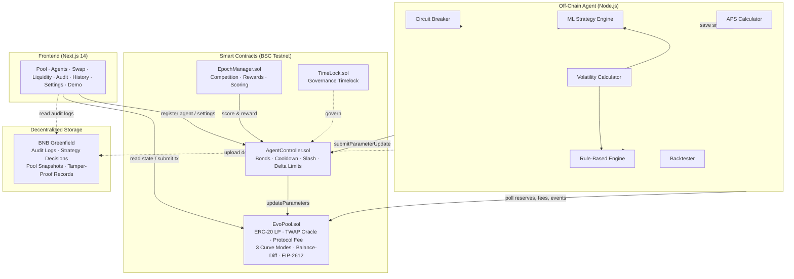

# EvoArena — Adaptive AI-Driven Liquidity Infrastructure for BNB Chain

> A permissionless AI agent marketplace where autonomous agents compete to control AMM parameters, dynamically reshaping bonding curves, fees, and liquidity — outperforming static AMMs in capital efficiency and volatility control.

## 🏗 Architecture



## 📦 Repository Structure

```
contracts/                Solidity smart contracts (Hardhat)
  EvoPool.sol             Adaptive AMM with ERC-20 LP, TWAP, protocol fees, EIP-2612 Permit
  AgentController.sol     Agent registry, bounds, cooldown, slashing, ERC-20 token bonding
  EpochManager.sol        On-chain epoch-based multi-agent competition
  TimeLock.sol            Governance timelock (queue/execute/cancel)
  EvoToken.sol            Minimal ERC-20 for protocol coordination
  interfaces/             Contract interfaces (IEvoPool, IAgentController, IEpochManager)

test/                     Contract tests (Mocha + Chai, 152 passing)
  AgentController.test.ts 45 tests — registration, updates, slashing, bonding
  EvoPool.test.ts         38 tests — liquidity, swaps, TWAP, protocol fees, pause
  EpochManager.test.ts    23 tests — epochs, proposals, finalization, rewards
  TimeLock.test.ts        9 tests — queue, execute, cancel, access control
  E2E.test.ts             13 tests — full lifecycle integration test
  Invariant.test.ts       24 tests — K invariant, reserve positivity, TWAP monotonicity, LP proportionality, stress

scripts/                  Deploy, verify & demo scripts
  deploy.ts               Full deployment with TimeLock governance transfer
  demo-local.ts           One-command live simulation (11 scenarios)

agent/                    Off-chain Node.js agent
  src/
    index.ts              Main loop — multi-pool, ML integration, circuit breaker
    executor.ts           On-chain execution with multicall batching
    strategyEngine.ts     Rule-based strategy engine (3 curve modes)
    mlStrategy.ts         Online linear regression ML model
    backtester.ts         Historical backtesting framework
    circuitBreaker.ts     Anomaly detection & auto-halt
    volatility.ts         EMA-based volatility calculator
    apsCalculator.ts      Agent Performance Score computation
    config.ts             Environment configuration
  state/                  APS snapshots & update logs

frontend/                 Next.js 14 dashboard (App Router + Tailwind)
  src/app/
    page.tsx              Pool overview with live charts
    agents/page.tsx       Agent leaderboard
    swap/page.tsx         Token swap UI
    liquidity/page.tsx    Add/remove liquidity UI
    history/page.tsx      Transaction history (Swaps, Liquidity, Parameters)
    settings/page.tsx     Agent strategy configuration UI
    demo/page.tsx         Interactive demo
    api/agent-stats/      REST API for agent stats
    api/aps/              APS scoring endpoint
  src/hooks/
    useEvoPool.ts         Pool state hook
    useWallet.tsx         Multi-wallet context (MetaMask + WalletConnect)
    usePolling.ts         Generic real-time polling hook
  src/lib/
    contracts.ts          ABIs, addresses, constants
    wallet.ts             Multi-wallet connection (MetaMask, WalletConnect, injected)
  src/components/
    Charts.tsx            Recharts visualizations
    WalletButton.tsx      Connect wallet button

subgraph/                 The Graph subgraph scaffold
  subgraph.yaml           Data source configuration (EvoPool, Controller, EpochManager)
  schema.graphql          Entity schema (Swap, Agent, Epoch, Proposal, etc.)
  src/mapping.ts          Event handlers

docs/                     Documentation
  architecture.md         System architecture + Mermaid diagrams
  user-journey.md         User flow diagrams (Trader, LP, Agent journeys)
  demo-walkthrough.md     Step-by-step demo verification
  demo.md                 Demo script for judges
  gas-report.md           Gas usage report

docker/                   Docker configuration
  Dockerfile.chain        Hardhat node + deployer image
  Dockerfile.frontend     Next.js production image
  Dockerfile.agent        Off-chain agent image
docker-compose.yml        One-command full-stack launch

.github/workflows/ci.yml  3-job CI pipeline (test+coverage+lint, agent, frontend)
```

## ✨ Features

### Smart Contracts
- **EvoPool**: Adaptive AMM with 3 curve modes (Normal, Defensive, VolatilityAdaptive)
- **ERC-20 LP Tokens**: Full ERC-20 composability with EIP-2612 Permit support
- **TWAP Oracle**: Uniswap-V2-style time-weighted average price accumulators
- **Protocol Fee Switch**: Configurable protocol fee (up to 20% of swap fee)
- **Balance-Diff Accounting**: Safe token accounting via balance snapshots
- **EpochManager**: On-chain multi-agent competition with scoring and rewards
- **TimeLock**: Governance timelock for admin operations (24h–7d delay)
- **ERC-20 Token Bonding**: Agents can stake ERC-20 tokens in addition to native bonds
- **Emergency Pause**: Owner can halt swaps/deposits while allowing LP emergency exits
- **Formal Slashing Criteria**: 3 enumerated conditions for agent slashing
- **Rate Limiting**: `parameterUpdateBlock` tracking prevents flash-loan attacks

### Off-Chain Agent
- **ML Strategy Engine**: Online linear regression with confidence-weighted predictions
- **Historical Backtesting**: Replay-based backtesting framework with strategy comparison
- **Circuit Breaker**: Anomaly detection (reserve drain, price crash, rapid updates)
- **Multi-Pool Support**: Single agent instance manages multiple pools
- **Gas Optimization**: Multicall batching for on-chain execution

### Frontend
- **7 Pages**: Pool, Agents, Swap, Liquidity, History, Settings, Demo
- **Multi-Wallet**: MetaMask + WalletConnect support
- **Real-Time Polling**: Auto-refresh pool and agent data
- **Agent Settings UI**: Submit parameter updates directly from the browser
- **Transaction History**: Browse swaps, liquidity events, and parameter updates
- **Mobile-Responsive**: Hamburger navigation for mobile devices
- **Agent Stats API**: REST endpoint at `/api/agent-stats?address=0x...`

### DevOps
- **Docker Compose**: One-command full-stack launch (chain + deployer + agent + frontend)
- **3-Job CI Pipeline**: test+coverage+lint, agent build, frontend build
- **Gas Snapshot**: Automated gas reporting as CI artifact
- **BSC Testnet + Mainnet**: Dual-network Hardhat configuration
- **Subgraph Scaffold**: Ready for The Graph deployment

## 🚀 Quick Start

### Option A: Docker (recommended)

Launch the entire stack in one command — Hardhat node, contract deployment, AI agent, and frontend:

```bash
docker-compose up --build
```

| Service | URL | Description |
|---------|-----|-------------|
| **Frontend** | [http://localhost:3000](http://localhost:3000) | Next.js dashboard |
| **Chain** | [http://localhost:8545](http://localhost:8545) | Local Hardhat node |
| **Agent** | — | Runs continuously in background |
| **Deployer** | — | Deploys contracts then exits |

To stop: `docker-compose down` · To reset: `docker-compose down -v`

### Option B: Manual Setup

### Prerequisites
- Node.js ≥ 18
- npm or yarn
- BSC Testnet (Chapel) RPC + funded wallet

### 1. Install dependencies
```bash
npm install
```

### 2. Configure environment
```bash
cp .env.example .env
# Fill in PRIVATE_KEY, BSC_TESTNET_RPC, BSCSCAN_API_KEY
```

### 3. Compile contracts
```bash
npx hardhat compile
```

### 4. Run tests
```bash
npx hardhat test          # 152 tests
npx hardhat coverage      # Coverage report
npm run test:gas          # Gas usage report
```

### 5. Deploy to BSC Testnet
```bash
npx hardhat run scripts/deploy.ts --network bscTestnet
```

### 6. Run the agent
```bash
cd agent && npm install
npm run once              # Single epoch
npm start                 # Continuous loop
npm run backtest          # Historical backtesting
```

### 7. Start frontend
```bash
cd frontend && npm install && npm run dev
```

### 8. Full demo
```bash
./demo.sh          # Quick: live simulation only (~5s)
./demo.sh full     # Full: compile + 152 tests + simulation + gas report
```

## 📊 Test Coverage

152 tests passing across 6 test files.

| Contract | Statements | Branches | Functions | Lines |
|----------|-----------|----------|-----------|-------|
| AgentController.sol | 100% | 78.89% | 100% | 100% |
| EvoPool.sol | 97.37% | 71.57% | 100% | 97.60% |
| EpochManager.sol | 92.73% | 65.38% | 86.67% | 95.00% |
| TimeLock.sol | 89.47% | 59.38% | 80.00% | 85.19% |
| **All contracts** | **95.38%** | **70.86%** | **93.22%** | **95.92%** |

## 📈 APS (Agent Performance Score)

Each epoch the agent computes:

| Component | Weight | Formula |
|-----------|--------|---------|
| LP Return Δ | 0.40 | `(lpReturn_agent - lpReturn_static) / lpReturn_static` |
| Slippage Reduction | 0.30 | `1 - (avgSlippage_agent / avgSlippage_static)` |
| Volatility Compression | 0.20 | `(σ_static - σ_agent) / σ_static` |
| Fee Revenue | 0.10 | `feeRevenue_agent / totalVolume` |

```
APS = 0.4·LPΔ + 0.3·SlippageReduction + 0.2·VolatilityCompression + 0.1·FeeRevenue
```

## 🔐 Security Model

| Constraint | Default | Configurable |
|------------|---------|-------------|
| Max fee change per update | 50 bps | ✅ |
| Max curveBeta change | 2000 (0.2 scaled) | ✅ |
| Cooldown between updates | 5 minutes | ✅ |
| Minimum agent bond | 0.01 tBNB | ✅ |
| Max fee cap | 500 bps (5%) | ✅ |
| Protocol fee cap | 2000 bps (20%) | ✅ |
| Governance timelock | 24h minimum | ✅ |
| Emergency pause | Owner only | ✅ |
| Formal slashing criteria | 3 conditions | ✅ |

### Slashing Conditions
1. **Excessive Deviation**: Parameters deviate >200bps from optimal in a single update
2. **Rapid Oscillation**: >5 updates within 10 minutes suggesting manipulation
3. **Manipulation Detected**: Evidence of coordinated front-running or sandwich attacks

## 🔗 Deployed Contracts — BSC Testnet (Chapel, Chain 97)

All contracts are **verified** on BscScan. Click to inspect source code and transactions.

| Contract | Address | BscScan |
|----------|---------|---------|
| **EvoToken A** | `0xAe6A9CaF9739C661e593979386580d3d14abB502` | [View ↗](https://testnet.bscscan.com/address/0xAe6A9CaF9739C661e593979386580d3d14abB502#code) |
| **EvoToken B** | `0x08DA91C81cebD27d181cA732615379f185FbFb51` | [View ↗](https://testnet.bscscan.com/address/0x08DA91C81cebD27d181cA732615379f185FbFb51#code) |
| **EvoPool** | `0x36Fda9F9F17ea5c07C0CDE540B220fC0697bBcE3` | [View ↗](https://testnet.bscscan.com/address/0x36Fda9F9F17ea5c07C0CDE540B220fC0697bBcE3#code) |
| **AgentController** | `0x163f03E4633B86fBB5C82c6e6a6aCbD1452bEe7c` | [View ↗](https://testnet.bscscan.com/address/0x163f03E4633B86fBB5C82c6e6a6aCbD1452bEe7c#code) |
| **EpochManager** | `0xab07a553a7237c39fBbf74b7FcC003013D0618D3` | [View ↗](https://testnet.bscscan.com/address/0xab07a553a7237c39fBbf74b7FcC003013D0618D3#code) |
| **TimeLock** | `0xf967B398c6Df05a1ED6b9DE15f0B93f8f253c1a6` | [View ↗](https://testnet.bscscan.com/address/0xf967B398c6Df05a1ED6b9DE15f0B93f8f253c1a6#code) |

> Deployer: [`0x3E7716BeE2D7E923CB9b572EB169EdFB6cdbDAB6`](https://testnet.bscscan.com/address/0x3E7716BeE2D7E923CB9b572EB169EdFB6cdbDAB6)

## 🌿 BNB Greenfield Integration

EvoArena integrates **BNB Greenfield** decentralized storage to create an immutable, tamper-proof audit trail of all AI agent decisions.

### What We Store
| Data Type | Description |
|---|---|
| **Agent Strategy Logs** | Every parameter update (fee, curveBeta, curveMode) is logged as a JSON object with timestamp, TX hash, and pool state |
| **Pool Snapshots** | Reserve balances and price data at the time of each agent decision |
| **Agent Metadata** | Registration events and strategy descriptions |

### How It Works
1. Agent submits parameter update on-chain via `AgentController.sol`
2. After TX confirmation, a structured JSON log is uploaded to Greenfield bucket `evoarena-audit-logs`
3. Logs are publicly readable — anyone can verify agent decisions
4. The `/audit` page in the frontend browses and displays all stored logs

### Greenfield Testnet Details
| Property | Value |
|---|---|
| Chain ID | `greenfield_5600-1` |
| RPC | `https://gnfd-testnet-fullnode-tendermint-us.bnbchain.org` |
| Storage Provider | `https://gnfd-testnet-sp1.bnbchain.org` |
| Bucket | `evoarena-audit-logs` |
| Explorer | [testnet.greenfieldscan.com](https://testnet.greenfieldscan.com/) |
| SDK | `@bnb-chain/greenfield-js-sdk v2.2.2` |

### Why Greenfield?
- **Transparency**: All AI agent decisions are publicly auditable
- **Immutability**: Stored on decentralized storage, not a centralized database
- **BNB Ecosystem**: Bridges BSC smart contracts with Greenfield storage
- **Cross-Chain**: Same wallet works on both BSC and Greenfield

## 🔗 References

- [Optimal Dynamic Fees for AMMs](https://arxiv.org/abs/2106.14404)
- [Uniswap v3 Concentrated Liquidity](https://docs.uniswap.org/concepts/protocol/concentrated-liquidity)
- [Bancor IL Protection](https://docs.bancor.network/)
- [Autonomous AI Agents in DeFi](https://arxiv.org/abs/2312.08027)

## 💰 Token Model & Revenue

| Revenue Stream | Description |
|---|---|
| **Protocol Fee** | Configurable fee (up to 20% of swap fees) accrues to protocol treasury |
| **Agent Bonds** | Agents stake tBNB as a slashable bond — aligns incentives |
| **Epoch Rewards** | Top-performing agents earn BNB rewards each epoch |
| **LP Fees** | Liquidity providers earn trading fees proportional to their share |

**Token Utility (EvoToken)**:
- Used as pool pair tokens for demonstration
- Agent bonding collateral (ERC-20 token bonding supported)
- Epoch reward distribution medium
- Governance participation (via TimeLock proposals)

## 🎯 Target Market

| Segment | Pain Point | How EvoArena Solves It |
|---|---|---|
| **DeFi LPs** | Static fees cause impermanent loss in volatile markets | AI agents dynamically optimize fees to maximize LP returns |
| **DEX Protocols** | Manual governance for parameter changes is slow (weeks/months) | Real-time agent competition adjusts in seconds |
| **Quant Teams** | No permissionless way to deploy trading strategies on-chain | Register as an agent, post bond, compete for rewards |
| **BNB Ecosystem** | Lacks innovative AMM infrastructure | First AI-driven adaptive AMM on BNB Chain |

## 🗺️ Roadmap

### Phase 1 — Hackathon MVP ✅ (Current)
- [x] Adaptive AMM with 3 curve modes (Normal, Defensive, VolatilityAdaptive)
- [x] Agent registry with bonding, cooldown, slashing
- [x] Epoch-based multi-agent competition
- [x] Governance timelock
- [x] Off-chain ML + rule-based agent
- [x] Circuit breaker & anomaly detection
- [x] Next.js frontend with 7 pages
- [x] BNB Greenfield audit trail
- [x] 152 tests, 95%+ coverage
- [x] BSC Testnet deployment (6 verified contracts)

### Phase 2 — Mainnet Ready (Q2 2026)
- [ ] Professional audit (CertiK / PeckShield)
- [ ] BSC Mainnet deployment
- [ ] Multi-pool support (any ERC-20 pair)
- [ ] The Graph subgraph deployment for indexed queries
- [ ] Agent SDK — npm package for building custom agents
- [ ] Advanced ML models (LSTM, transformer-based volatility prediction)

### Phase 3 — Ecosystem Growth (Q3 2026)
- [ ] Agent marketplace — discover and delegate to top agents
- [ ] LP vault aggregator — auto-route liquidity to best-performing pools
- [ ] opBNB L2 integration for gas-efficient agent updates
- [ ] Cross-chain expansion (Ethereum, Arbitrum, Base)
- [ ] Mobile app for LP monitoring

### Phase 4 — Decentralized Governance (Q4 2026)
- [ ] EVO governance token launch
- [ ] DAO-controlled protocol parameters
- [ ] Community agent bounties
- [ ] Insurance fund for LP protection
- [ ] Partnership integrations (PancakeSwap, Venus, Alpaca Finance)

## 🧩 Dependencies & Credits

| Package | Version | Purpose |
|---------|---------|---------|
| [OpenZeppelin Contracts](https://github.com/OpenZeppelin/openzeppelin-contracts) | v5.0 | ERC-20, Ownable, Pausable, ReentrancyGuard |
| [Hardhat](https://hardhat.org/) | v2.22 | Smart contract development & testing |
| [ethers.js](https://docs.ethers.org/v6/) | v6.11 | Blockchain interaction (frontend + agent) |
| [Next.js](https://nextjs.org/) | v14.1 | Frontend framework (App Router) |
| [Tailwind CSS](https://tailwindcss.com/) | v3.4 | Utility-first CSS |
| [Recharts](https://recharts.org/) | v2.12 | Data visualization charts |
| [Framer Motion](https://www.framer.com/motion/) | v12.34 | Animation library |
| [Three.js](https://threejs.org/) / React Three Fiber | v0.167 / v8.18 | 3D visualization |
| [WalletConnect](https://walletconnect.com/) | v2.23 | Multi-wallet connectivity |
| [BNB Greenfield SDK](https://github.com/bnb-chain/greenfield-js-sdk) | v2.2.2 | Decentralized storage integration |
| [Lucide React](https://lucide.dev/) | v0.575 | Icon library |

## 📝 License

MIT — see [LICENSE](./LICENSE).
