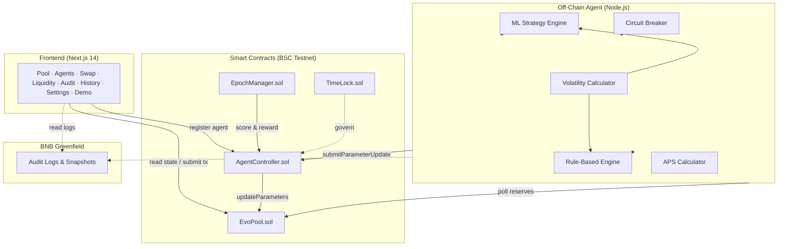

# EvoArena — Technical Documentation

## System Architecture



## Tech Stack

| Layer | Technology |
|-------|-----------|
| Smart Contracts | Solidity 0.8.24, OpenZeppelin v5, Hardhat |
| Blockchain | BSC Testnet (Chain 97) |
| Frontend | Next.js 14 (App Router), Tailwind CSS, Recharts, Framer Motion, Three.js |
| Agent | Node.js, TypeScript, ethers.js v6 |
| Storage | BNB Greenfield (`@bnb-chain/greenfield-js-sdk v2.2.2`) |
| Wallet | MetaMask, WalletConnect v2 |
| CI/CD | GitHub Actions (3-job pipeline) |
| Deployment | Docker Compose (one-command) |

## Setup Instructions

### Option A: Docker (Recommended)

```bash
git clone https://github.com/DiveshK007/EvoArena.git
cd EvoArena
docker-compose up --build
```

This launches:
- **chain** — Hardhat local node on port 8545
- **deployer** — Deploys all contracts (runs once, then exits)
- **frontend** — Next.js on port 3000
- **agent** — AI agent running continuously

### Option B: Manual Setup

```bash
# 1. Install
git clone https://github.com/DiveshK007/EvoArena.git
cd EvoArena
npm install

# 2. Configure
cp .env.example .env
# Fill in: PRIVATE_KEY, BSC_TESTNET_RPC, BSCSCAN_API_KEY

# 3. Compile & test
npx hardhat compile
npx hardhat test          # 152 tests

# 4. Deploy
npx hardhat run scripts/deploy.ts --network bscTestnet

# 5. Start agent
cd agent && npm install && npm start

# 6. Start frontend
cd frontend && npm install && npm run dev
# Open http://localhost:3000
```

## Smart Contracts

### EvoPool.sol
- Constant-product AMM (`x·y=k`) with 3 adaptive curve modes
- ERC-20 LP tokens with EIP-2612 Permit
- TWAP price oracle (Uniswap V2-style cumulative accumulators)
- Protocol fee switch (up to 20% of swap fee)
- Balance-diff accounting for safe token handling
- Emergency pause with LP exit guarantee

### AgentController.sol
- Agent registry with BNB + ERC-20 token bonding
- Bounded parameter updates (max Δ per update)
- Cooldown enforcement (5 min default)
- Formal slashing criteria (3 conditions)
- Rate limiting to prevent flash-loan attacks

### EpochManager.sol
- On-chain epoch-based competition (1 hour default)
- Multi-agent scoring and ranking
- Automated reward distribution

### TimeLock.sol
- Governance timelock (24h–7d delay)
- Queue, execute, cancel operations
- Admin transfer via timelock

## Agent Architecture

```
Poll Loop (every 30s)
  ├── Fetch pool state (reserves, fee, events)
  ├── Compute features
  │   ├── EMA volatility
  │   ├── Trade velocity
  │   └── Whale detection
  ├── Strategy engine
  │   ├── Rule-based (3 curve mode rules)
  │   └── ML (online linear regression)
  ├── Circuit breaker check
  │   ├── Reserve drain detection
  │   ├── Price crash detection
  │   └── Rapid update detection
  ├── Submit parameter update TX
  ├── Compute APS score
  └── Upload decision log to Greenfield
```

## BNB SDK Integration

### ethers.js v6 — Smart Contract Interaction
- Frontend reads pool state, submits swaps, adds/removes liquidity
- Agent polls reserves, submits parameter updates via `AgentController`
- Full TypeChain-generated type-safe bindings

### @bnb-chain/greenfield-js-sdk v2.2.2 — Decentralized Storage
- Uploads agent decision logs as JSON objects to Greenfield bucket
- Frontend `/audit` page reads and displays stored logs
- Bucket: `evoarena-audit-logs` on Greenfield Testnet

### WalletConnect v2 — Multi-Wallet Support
- MetaMask direct injection + WalletConnect QR code
- Automatic BSC Testnet network switching
- Multi-provider detection (handles Core Wallet conflicts)

## Demo Guide

### Quick Demo (5 seconds)
```bash
./demo.sh
```

### Full Demo (compile + test + simulate)
```bash
./demo.sh full
```

### Manual Walkthrough
1. Open http://localhost:3000
2. Connect MetaMask (BSC Testnet)
3. View pool dashboard — see reserves, fee, curve mode
4. Navigate to `/swap` — swap EVOA ↔ EVOB
5. Navigate to `/liquidity` — add/remove liquidity, receive LP tokens
6. Navigate to `/agents` — view agent leaderboard
7. Navigate to `/settings` — register as agent, configure strategy
8. Navigate to `/audit` — browse Greenfield audit logs
9. Navigate to `/history` — view transaction history

## Test Coverage

```
152 tests passing across 6 files:
  AgentController.test.ts — 45 tests
  EvoPool.test.ts         — 38 tests
  EpochManager.test.ts    — 23 tests
  TimeLock.test.ts        — 9 tests
  E2E.test.ts             — 13 tests
  Invariant.test.ts       — 24 tests

Overall: 95.38% statements, 70.86% branches, 93.22% functions, 95.92% lines
```
