# EvoArena — User Journey Documentation

## Overview

EvoArena serves three distinct user roles: **Traders**, **Liquidity Providers (LPs)**, and **AI Agents**. Each journey is designed to be intuitive, with progressive disclosure of complexity.

---

## 1. Trader Journey

```mermaid
flowchart TD
    T1[Visit EvoArena] --> T2[Connect MetaMask / WalletConnect]
    T2 --> T3{On BSC Testnet?}
    T3 -->|No| T4[Switch Network Prompt]
    T4 --> T3
    T3 -->|Yes| T5[View Pool Dashboard]
    T5 --> T6[Navigate to Swap Page]
    T6 --> T7[Select Token Pair EVOA ↔ EVOB]
    T7 --> T8[Enter Amount]
    T8 --> T9[Review Price Impact & Slippage]
    T9 --> T10[Approve Token Spending]
    T10 --> T11[Confirm Swap TX]
    T11 --> T12{TX Success?}
    T12 -->|Yes| T13[View Updated Balances]
    T12 -->|No| T14[Error Toast with Details]
    T13 --> T15[Check History Page for TX Record]
    T15 --> T6

    style T1 fill:#F5A623,color:#000
    style T13 fill:#7ED321,color:#000
    style T14 fill:#D0021B,color:#fff
```

### Trader UX Improvements vs Static AMMs
- **Dynamic fees** adjust automatically — lower fees in calm markets, higher in volatile
- **Whale protection** via Defensive curve mode — large trades incur quadratic penalty
- **Real-time price impact** shown before confirmation
- **Transaction history** page for full audit trail

---

## 2. Liquidity Provider Journey

### LP UX Improvements vs Static AMMs
- **ERC-20 LP tokens** — fully composable, can be transferred or used in other DeFi
- **EIP-2612 Permit** — gasless approvals for add/remove liquidity
- **AI-optimized fees** — agents maximize fee revenue while minimizing impermanent loss
- **Emergency exit** — LPs can always withdraw even when pool is paused
- **Protocol fee transparency** — visible on-chain, capped at 20%

---

## 3. AI Agent Journey

### Agent Competitive Loop

---

## 4. Full System Flow — All Roles

```mermaid
flowchart LR
    subgraph Users
        Trader[🔄 Trader]
        LP[💧 LP Provider]
    end

    subgraph Frontend ["Frontend (Next.js)"]
        Swap[Swap Page]
        Liq[Liquidity Page]
        Dash[Dashboard]
        Agents[Agent Leaderboard]
        Audit[Audit Page]
        History[History Page]
    end

    subgraph Chain ["BSC Testnet"]
        Pool[EvoPool.sol]
        Ctrl[AgentController.sol]
        Epoch[EpochManager.sol]
        TL[TimeLock.sol]
    end

    subgraph AI ["Off-Chain Agent"]
        Engine[Strategy Engine]
        ML[ML Model]
        CB[Circuit Breaker]
    end

    subgraph Storage ["BNB Greenfield"]
        Logs[Audit Logs]
    end

    Trader --> Swap --> Pool
    LP --> Liq --> Pool
    Trader --> History
    LP --> Dash

    Engine --> Ctrl --> Pool
    ML --> Engine
    CB --> Engine

    Epoch --> Ctrl
    TL -.-> Ctrl

    Engine --> Logs
    Audit --> Logs

    Agents --> Ctrl
    Dash --> Pool

    style Trader fill:#F5A623,color:#000
    style LP fill:#4A90D9,color:#fff
    style Engine fill:#7ED321,color:#000
```

---

## 5. UX Comparison: EvoArena vs Traditional AMMs

| Feature | Traditional AMM (e.g. Uniswap v2) | EvoArena |
|---------|-----------------------------------|----------|
| Fee Adjustment | Fixed forever at deploy time | AI agents adjust every epoch |
| Whale Protection | None — large trades cause massive slippage | Defensive curve mode with quadratic penalty |
| LP Tokens | Custom non-standard | Full ERC-20 with EIP-2612 Permit |
| Price Oracle | Basic TWAP | TWAP with cumulative price accumulators |
| Parameter Governance | DAO vote (slow, months) | Real-time agent competition (seconds) |
| Audit Trail | Etherscan only | Greenfield decentralized storage + on-chain |
| Emergency Controls | None or admin key | Pause + LP emergency exit + timelock |
| Market Adaptation | Manual redeployment | Automatic via ML + rule engine |
